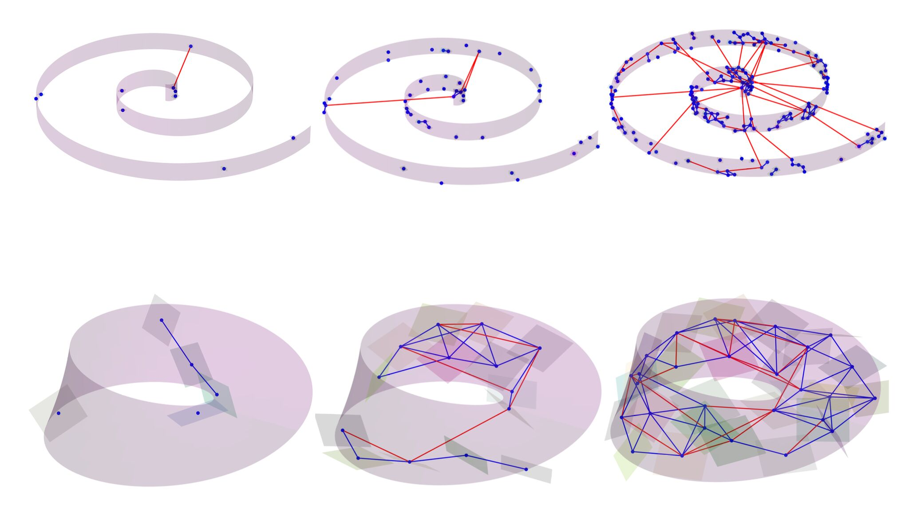
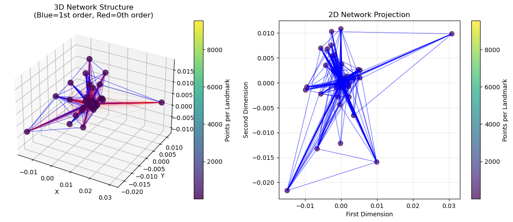

# Fast, Accurate Manifold Denoising by Tunneling Riemannian Optimization
 
📄 [**“Fast, Accurate Manifold Denoising by Tunneling Riemannian Optimization” (ICML 2025)**](https://arxiv.org/pdf/2502.16819)

---

## 🌌 Overview

- **Novel denoising framework** that learns to optimize over unknown Riemannian manifolds using only noisy samples, achieving test-time efficiency through "learning-to-denoise" as "learning-to-optimize"

- **Mixed-order optimization method** combining efficient first-order (gradient) steps for local navigation with zero-order (tunneling) steps to escape local minima and guarantee global optimality

- **Online learning algorithm** that incrementally builds a traversal network one sample at a time, learning landmarks, tangent spaces, and edge embeddings directly from noisy data

- **Superior complexity-accuracy tradeoffs** compared to nearest neighbor search and other baseline methods, demonstrated on synthetic manifolds and real scientific data (gravitational waves, images)

---

## 🌀 Visual Intuition

### Growing Traversal Networks

  

> **Manifolds with zero-order (red) and first-order (blue) connections**, visualizing tangent-space geometry as the network grows from sparse to dense coverage.

### Network Structure Visualization

  

> **3D and 2D projections of the manifold network structure**. First-order edges (blue) enable gradient-based navigation, while zero-order edges (red) provide tunnels to escape local minima. Node color intensity represents data point density.

---

## 📈 Results

### Signal Denoising

  

> **Gravitational wave signal reconstruction** showing noisy input vs. denoised output.

### Performance Analysis

  

> **Computational efficiency gains** - our method achieves better accuracy with lower computational cost compared to nearest neighbor baselines.

---